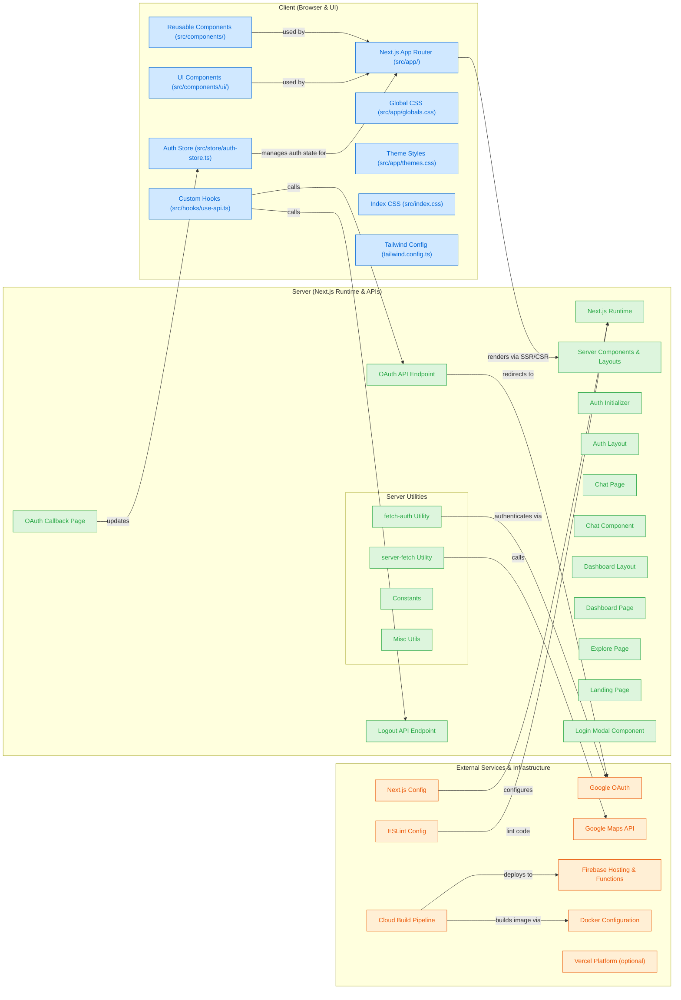

## Getting Started

First, run the development server:
```bash
pnpm install
pnpm dev
```
Open [http://localhost:3000](http://localhost:3000) with your browser to see the result.

You can start editing the page by modifying `app/page.tsx`. The page auto-updates as you edit the file.

This project uses [`next/font`](https://nextjs.org/docs/app/building-your-application/optimizing/fonts) to automatically optimize and load [Geist](https://vercel.com/font), a new font family for Vercel.

## Learn More


## Deploy on GCP
This Service Deploy on GCP with Google Maps, Google Auth, Firebase.
